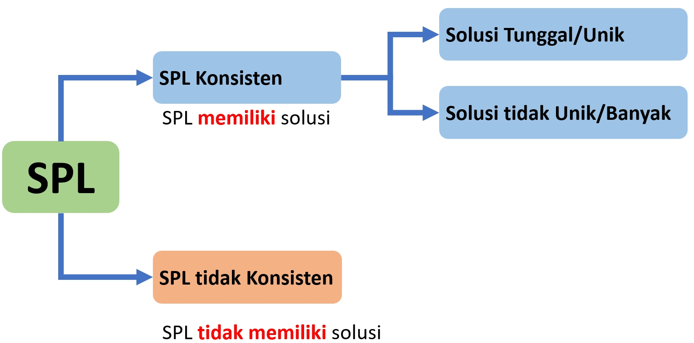
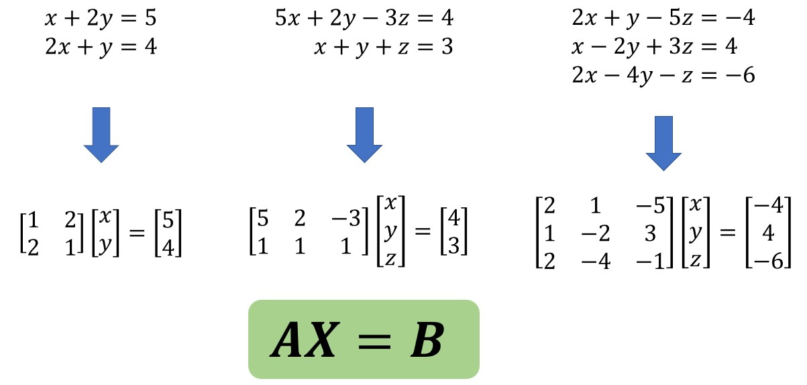
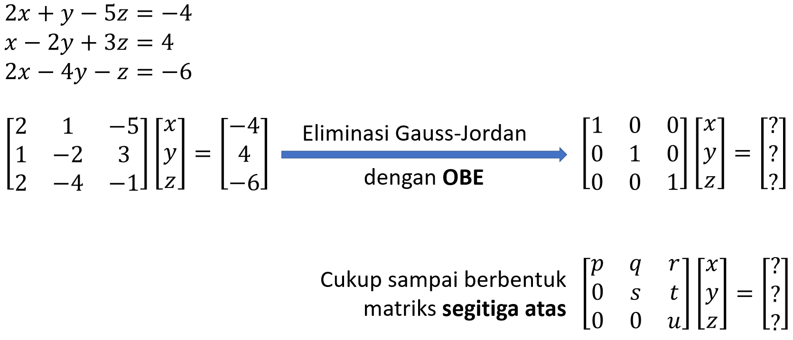
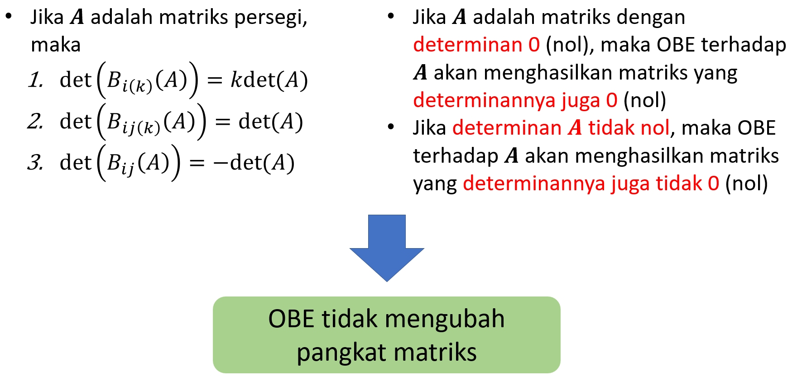
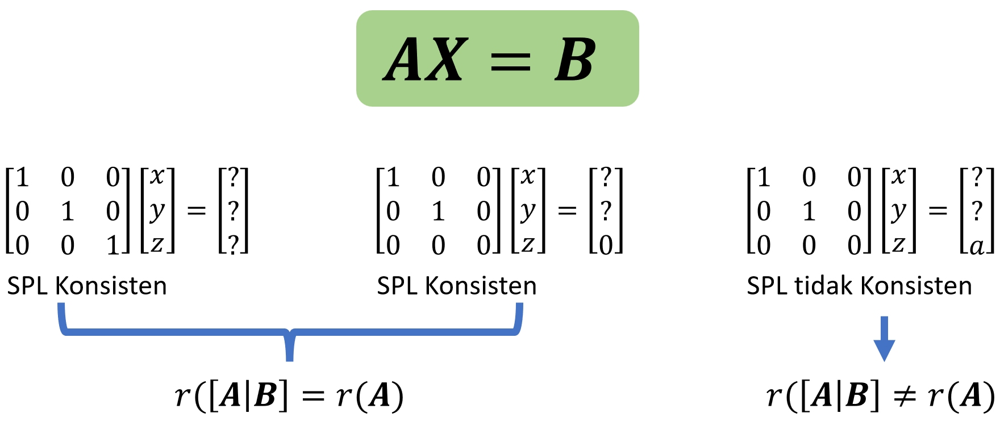
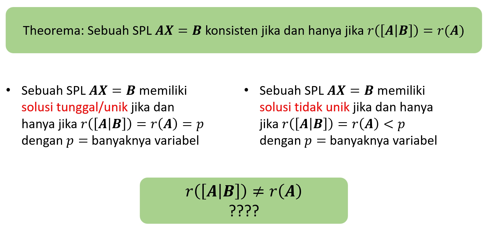

```{r xaringanExtra, echo=FALSE}
xaringanExtra::use_xaringan_extra(c("tile_view", "animate_css", "tachyons"))
```

```{r xaringan-panelset, echo=FALSE}
xaringanExtra::use_panelset()
```

```{r xaringan-scribble, echo=FALSE}
xaringanExtra::use_scribble()
```

```{r xaringan-logo, echo=FALSE}
xaringanExtra::use_logo(
  image_url = "Unsera.png"
)
```

```{r xaringanExtra-webcam, echo=FALSE}
xaringanExtra::use_webcam()
```

```{r xaringanExtra-search, echo=FALSE}
xaringanExtra::use_search(show_icon = TRUE)
```

.pull-left[

# .purple[**Outline**]

- ## Pengertian Sistem Persamaan Linier (SPL) <br>
- ## Solusi SPL <br>
- ## Kekonsistenan SPL 


]

.pull-right[

<br><br><br><br>


]

---

class: center, middle, inverse

# .red[**Sistem Persamaan Linier**]

---

.pull.center[
### **Sistem Persamaan Linier**]

- ### Terdiri atas beberapa persamaan
- ### Seluruh persamaan berbentuk linear


### $\qquad x+2y=5 \qquad \qquad \qquad \begin{align*}x+2y&=5 \\ 2x+4&=4 \end{align*}$
### $\begin{matrix} \begin{align*}5x+2y-3z&=4 \\ x+y+z&=3 \end{align*} \end{matrix}$ $\qquad \qquad \begin{align*}2x+y-5z&=-4 \\ x-2y+3z&=4 \\ 2x-4y-z &= -6\end{align*}$

---

.pull.center[
### **Solusi bagi SPL**]

### $\begin{align*}x+2y&=5 \\ 2x+y&=4 \end{align*} \Rightarrow(x,y)=(1,2)\text{ merupakan solusi}$

### $\begin{align*}x+2y&=5 \\ 2x+y&=4 \end{align*} \Rightarrow\begin{array}{ll}(x,y,z)=(1,1,0)\text{ merupakan solusi}\\(x,y,z)=(0,\frac{1}{2},1)\text{ juga merupakan solusi}\end{array}$

### $\begin{align*}x+2y&=5 \\ 2x+4y&=10 \end{align*} \Rightarrow\begin{array}{ll}\text{tidak ada }(x,y)\text{ yang memenuhi} \\ \text{SPL ini} \color{red}{\textbf{ tidak memiliki}}\text{ solusi}\end{array}$

---

.pull.center[
### **Kategori SPL**]



---

.pull.center[
### **SPL Homogen**]

.pull-left[

### SPL Homogen:<br>Seluruh ruas kanannya bernilai .red[**0**] (nol)

### Sifat SPL Homogen:<br>Selalu konsisten (selalu ada solusi)

### Salah satu solusinya adalah semua variabel bernilai .red[**0**] (nol)


]

.pull-right[

### $\begin{align*}x+2y&=0 \\ 2x+y&=0 \end{align*}$
### $\begin{align*}3x+2y+4z&=0 \\ 2x+2y+3z&=0 \end{align*}$
]

---

class: center, middle, inverse

# .red[**Solusi Sistem Persamaan Linier**]

---

.pull.center[
### **Menentukan Solusi SPL**]

.pull-left[

### .red[**Metode Substitusi**]

1. ### Menyatakan suatu variable sebagai fungsi dari variable yang lain berdasarkan suatu persamaan
1. ### Mensubstitusikan variable di persamaan lain dengan variable dari bagian 1)

]

.pull-right[
  
### $\begin{align*}x+2y&=5 \\ 2x+y&=4 \end{align*}$

]

---

.pull.center[
### **Menentukan Solusi SPL**]

### .red[**Metode Substitusi**]

### $\begin{align*}2x+y-5z&=-4 \\ x-2y+3z&=4 \\ 2x-4y-z&=-6 \end{align*}$


---

.pull.center[
### **Menentukan Solusi SPL**]

.pull-left[

### .red[**Metode Eliminasi**]

1. ### Menggunakan 2 persamaan untuk menghilangkan (mengiliminasi) salah satu variable sehingga diperoleh persamaan yang lebih sederhana
1. ### Terus dilakukan hingga variable tersisa dapat ditemukan solusinya

]

.pull-right[
  
### $\begin{align*}x+2y&=5 \\ 2x+y&=4 \end{align*}$

]

---

.pull.center[
### **Menentukan Solusi SPL**]

### .red[**Metode Eliminasi**]

### $\begin{align*}2x+y-5z&=-4 \\ x-2y+3z&=4 \\ 2x-4y-z&=-6 \end{align*}$

---

.pull.center[
### **SPL dalam Notasi Matriks**]



---

.pull.center[
### **Metode Cramer**]

- ### Diambil dari matematikawan Swiss, Gabriel Cramer (1704 – 1752).
- ### Digunakan untuk mencari solusi SPL dengan banyaknya variabel sama dengan banyaknya persamaan.
- ### Dalam SPL $\textbf{AX}=\textbf{B}$, matriks $\textbf{A}$ adalah matriks persegi dengan $\text{det}(\textbf{A})\ne 0$.
- ### Solusi SPL $\textbf{AX}=\textbf{B}$ adalah

.pull-left[
### $$x_i=\frac{\text{det}(\textbf{A}_i)}{\text{det}(\textbf{A})}$$
]

.pull-right[
### $x_i$ adalah elemen $\textbf{X}$ ke-i
### $\textbf{A}_i$ adalah matriks $\textbf{A}$ dengan kolom ke- $i$ diganti oleh $\textbf{B}$
]

---

.pull.center[
### **Metode Cramer**]

### $\begin{align*}x+2y&=5 \\ 2x+y&=4 \end{align*}$
### $\begin{bmatrix} 1&2 \\ 2& 1 \end{bmatrix}\begin{bmatrix} x \\ y  \end{bmatrix}=\begin{bmatrix} 5 \\ 4 \end{bmatrix}$

---

.pull.center[
### **Metode Cramer**]

### $\begin{align*}2x+y-5z&=-4 \\ x-2y+3z&=4 \\ 2x-4y-z&=-6 \end{align*}$

### $\begin{bmatrix} 2&1&-5 \\ 1&-2&3 \\ 2&-4&-1 \end{bmatrix}\begin{bmatrix} x \\ y \\ z \end{bmatrix}=\begin{bmatrix} -4 \\ 6 \\ 4 \end{bmatrix}$

---

.pull.center[
### **Eliminasi Gauss-Jordan**]



---

.pull.center[
### **Eliminasi Gauss-Jordan**]

### $\begin{align*}x+2y&=5 \\ 2x+y&=4 \end{align*}$
### $\begin{bmatrix} 1&2 \\ 2& 1 \end{bmatrix}\begin{bmatrix} x \\ y  \end{bmatrix}=\begin{bmatrix} 5 \\ 4 \end{bmatrix}$

---

.pull.center[
### **Eliminasi Gauss-Jordan**]

### $\begin{align*}2x+y-5z&=-4 \\ x-2y+3z&=4 \\ 2x-4y-z&=-6 \end{align*}$

### $\begin{bmatrix} 2&1&-5 \\ 1&-2&3 \\ 2&-4&-1 \end{bmatrix}\begin{bmatrix} x \\ y \\ z \end{bmatrix}=\begin{bmatrix} -4 \\ 6 \\ 4 \end{bmatrix}$

---

class: center, middle, inverse

# .red[**Kekonsistenan SPL**]

---

.pull.center[
### **OBE, Determinan, dan Pangkat Matriks**]



---

.pull.center[
### **Pangkat Matriks dan Kekonsistenan SPL**]




---

.pull.center[
### **Pangkat Matriks dan Kekonsistenan SPL**]



---

class: inverse, middle, center

# Thank you
# See you next week!

